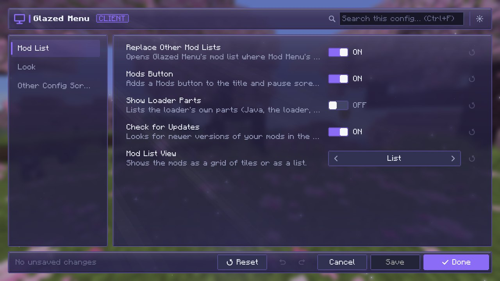
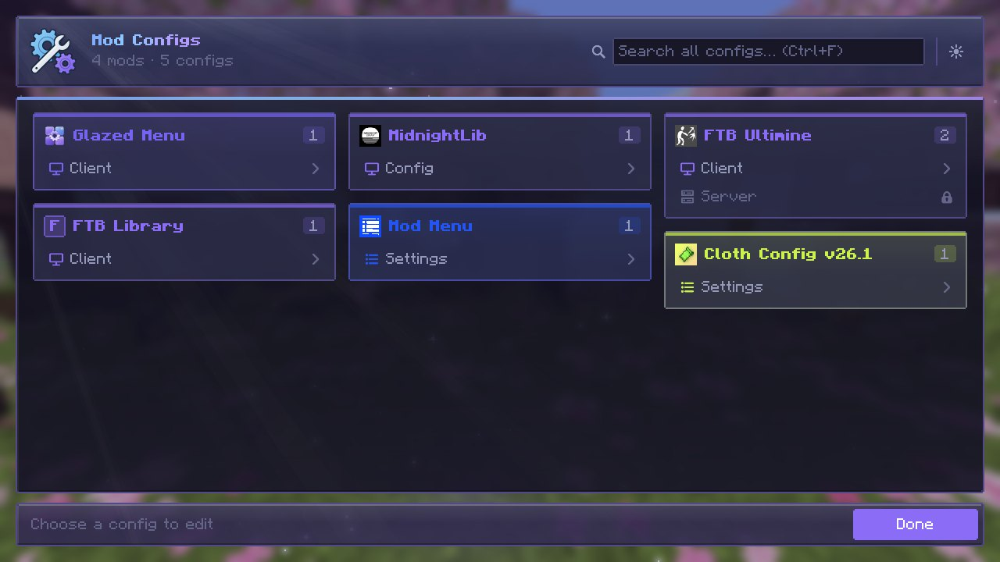
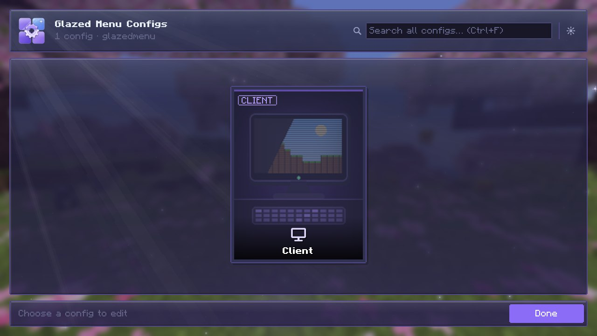
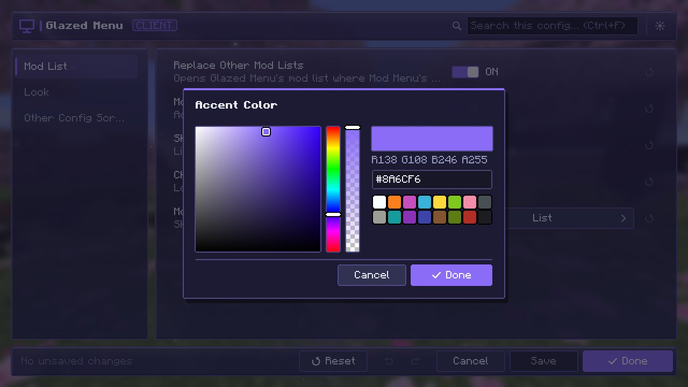
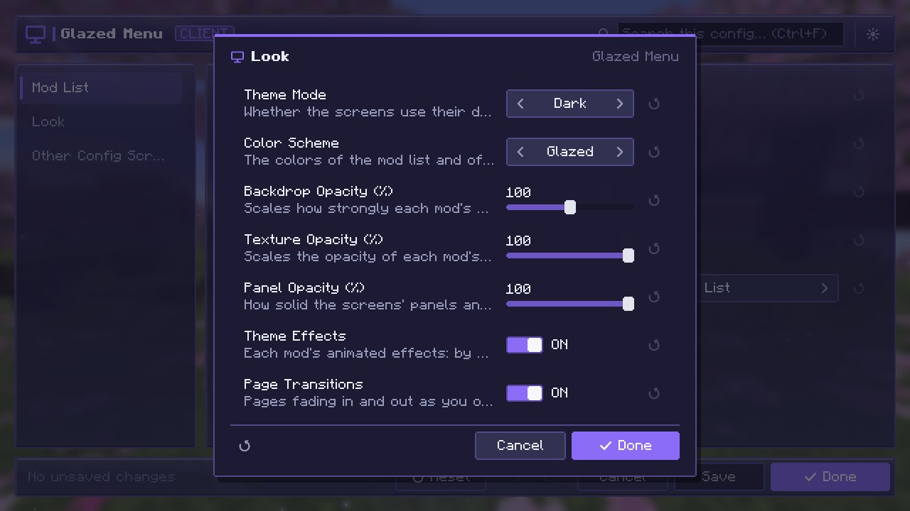

# Config Screens

One look for every mod's settings, whichever config library the mod uses.

{ .gm-shot loading=lazy }

## Opening one

- In the [mod list](mod-list.md), select a mod and press **Settings**.
- `/glazedmenu` in chat lists every mod's configs; `/glazedmenu <mod>` opens one mod's.

{ .gm-shot loading=lazy }

## Each config as a card

A mod's configs are shown as cards: client, common, server and so on. Pick one to open its screen.

{ .gm-shot loading=lazy }

## What every screen has

- A **sidebar of categories** and **search** across all of them.
- **Undo / redo** and **reset**, per value or for everything shown.
- **Presets**, where the mod defines them.
- **Validation** as you type, and **restart notices** for values that need one.
- **List editing** and a **color picker**.

Nothing is written until you press **Save** or **Done**; **Cancel** leaves the config as it was.

{ .gm-shot loading=lazy }

### Keyboard

| Keys | Does |
|---|---|
| ++ctrl+f++ | Jump to the search box. |
| ++ctrl+z++ | Undo. |
| ++ctrl+y++ | Redo. |
| ++ctrl+s++ | Save. |

## A category as a popup

A single category can open as a small window over whatever screen you're on, with its own **Save** and **Cancel**: `/glazedmenu <mod> <config>/<category>`. Mods can open one from their own buttons too.

{ .gm-shot loading=lazy }

## Which configs it reads

| Library | Notes |
|---|---|
| **CoolCatLib: Core** | With the mod's own theme. |
| **NeoForge** (`ModConfigSpec`) | On Fabric through Forge Config API Port, which also covers Forge's `ForgeConfigSpec`. |
| **Cloth Config** (AutoConfig) | |
| **YACL** | |
| **MidnightLib** | |
| **MezzConfig** (JEI) | Off by default; turn it on in [Glazed Menu's settings](settings.md#other-config-screens). |
| **FTB Library** (FTB mods) | Off by default; turn it on in [Glazed Menu's settings](settings.md#other-config-screens). |

A mod with its own config screen gets a link to that screen instead.
