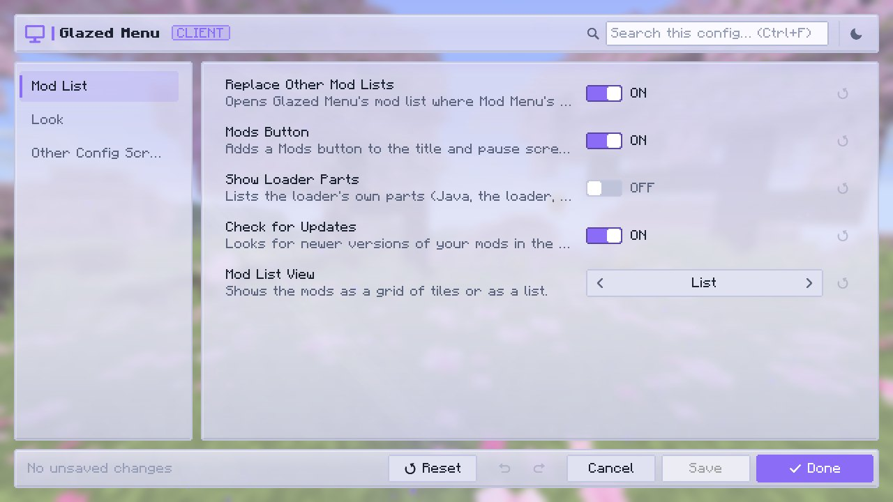

# Looks

How the mod list and every config screen look is yours to choose. All of it is under **Look** in [Glazed Menu's settings](settings.md#look).

## Dark and light

Both modes are complete: every screen, popup and editor has a dark and a light version. Switch with the sun/moon button in a screen's top bar, or with **Theme Mode** in the settings.

{ .gm-shot loading=lazy }

{ .gm-shot loading=lazy }

## Color schemes

**Color Scheme** sets the colors of the mod list and of every config screen that has no theme of its own. There are seven: **Glazed** (the default), **Classic**, **Ocean**, **Forest**, **Ember**, **Rose** and **Slate**.

Two things keep their own colors whatever the scheme:

- **The mod list** shows each mod in colors taken from its logo.
- **A mod's config screens** use the mod's theme when it has one, from the mod itself or from a resource pack. See [Theming](../authors/theming.md).

## See-through panels

Behind the panels is the title panorama, or your world while you play, blurred. Three sliders decide how much of it you see:

| Slider | What it changes |
|---|---|
| **Panel Opacity** | How solid the panels and bars are. Lower lets more of the background show through. |
| **Backdrop Opacity** | How strongly the color laid over the background covers it. |
| **Texture Opacity** | How solid a mod's own background texture is, when it has one. |

## Motion

- **Theme Effects**: animated effects behind the panels. By default soft glows and small falling stars; a mod's theme can bring its own.
- **Page Transitions**: screens fade into one another.

Both can be turned off, and the game's Fast graphics preset always turns the effects off.
