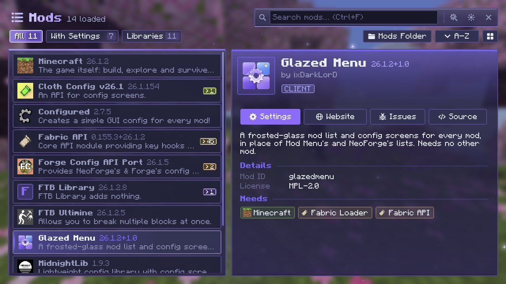
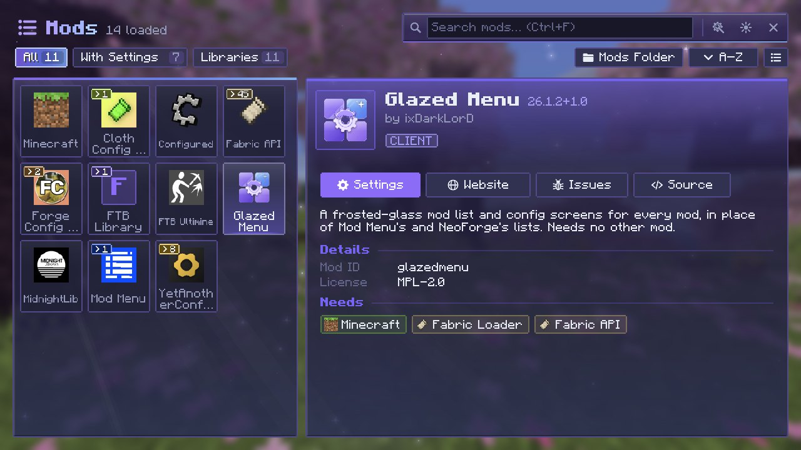
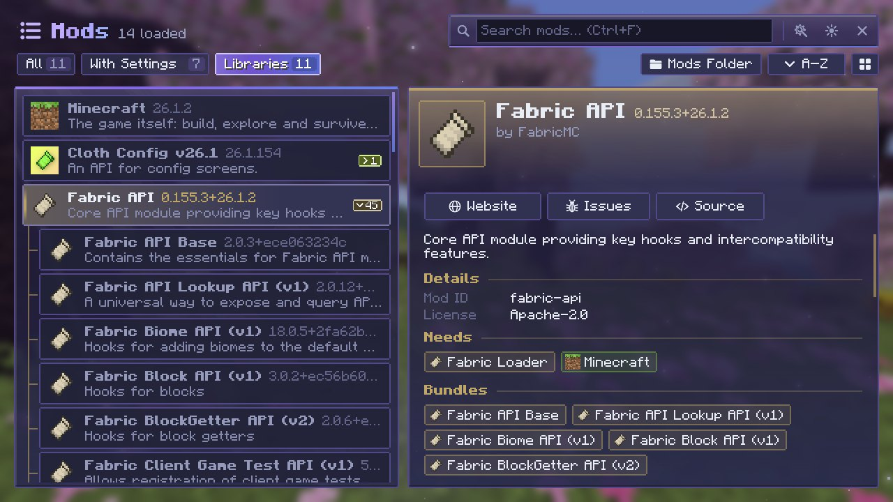

# The Mod List

Glazed Menu's mod list takes the place of Mod Menu's, NeoForge's and Forge's. Where no mod list added a **Mods** button to the title and pause screens, Glazed Menu adds one.

{ .gm-shot loading=lazy }

## Opening it

- The **Mods** button on the title screen or the pause screen.
- `/glazedmenu mods` in chat.

## Finding a mod

- **Search** by typing; ++ctrl+f++ jumps to the search box.
- **Filters** for **All**, **With Settings** and **Libraries**, each with a count.
- **A–Z / Z–A** sorting.
- **Grid or list view**: large tiles a few to a row, or one mod per row with its version and description.

{ .gm-shot loading=lazy }

## Groups

Mods that bundle others, like Fabric API and its modules, open and close as one group, under **All** and under **Libraries**.

{ .gm-shot loading=lazy }

Library mods stay out of the way under **Libraries**. The loader's own parts (Java, the loader, MixinExtras) are listed only there, unless you turn on **Show Loader Parts** in the [settings](settings.md#mod-list).

## A mod's details

Every mod is shown in its own colors, taken from its logo. The details pane has:

- its description, authors and license,
- what it needs and what it bundles,
- **Settings**, **Website**, **Issues** and **Source** buttons.

**Settings** opens the mod's configs in Glazed Menu's [config screens](config-screens.md), or the mod's own config screen when it has one.

## Update notices

Mods that publish an update file get a mark in the list, and the details pane shows the new version. On NeoForge and Forge that is the mod's usual update file; on Fabric a mod [points Glazed Menu at one](../authors/metadata.md#update-notices).

The check runs once the game has loaded. Turn it off with **Check for Updates** in the [settings](settings.md#mod-list).

## Extras

- A button to **open the mods folder**.
- The game's own **options**, listed as Minecraft's settings.
- `/glazedmenu` opens every mod's configs, `/glazedmenu <mod>` one mod's, and `/glazedmenu <mod> <config>/<category>` one category directly.
