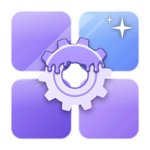
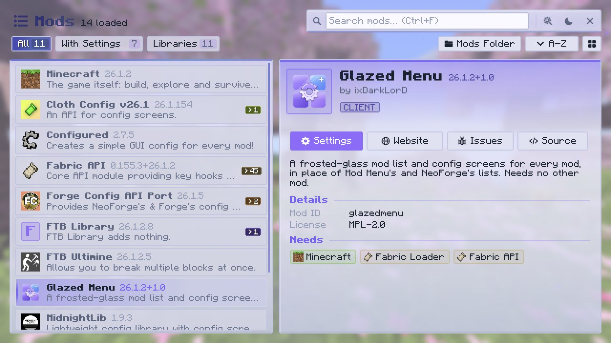

  

# Glazed Menu { .gm-hero__title }

A glassy mod list and config screens for every mod.

Client side, for Fabric, NeoForge and Forge, on Minecraft 1.20 to 26.3. It needs no other mod.

[:simple-modrinth: Modrinth](https://modrinth.com/mod/glazedmenu){ .md-button .md-button--primary }
[:simple-curseforge: CurseForge](https://www.curseforge.com/minecraft/mc-mods/glazed-menu){ .md-button }
[:fontawesome-brands-github: Source](https://github.com/ixDarkLorD/GlazedMenu){ .md-button }

  
  
  
  

  

## What it does

Glazed Menu replaces Mod Menu's, NeoForge's and Forge's mod lists with its own, and gives the configs of almost any mod one clean, themed screen.

-   :material-view-grid-outline:{ .lg .middle } **A mod list worth opening**

    ---

    Grid or list, filters, search and sorting. Every mod in its own colors, with a details pane and update notices.

    [:octicons-arrow-right-24: The mod list](guide/mod-list.md)

-   :material-tune-variant:{ .lg .middle } **One config screen for every mod**

    ---

    Categories, search, undo and redo, presets and validation, for configs from CoolCatLib, NeoForge, Cloth Config, YACL and more.

    [:octicons-arrow-right-24: Config screens](guide/config-screens.md)

-   :material-palette-outline:{ .lg .middle } **Your look**

    ---

    Dark and light modes, seven color schemes, panel opacity, background effects and page transitions.

    [:octicons-arrow-right-24: Looks](guide/looks.md)

-   :material-code-braces:{ .lg .middle } **Friendly to mod authors**

    ---

    It works with your mod as it is. A few optional files mark a library, announce updates or theme your screens.

    [:octicons-arrow-right-24: For mod authors](authors/index.md)

## A closer look

{ .gm-shot loading=lazy }

{ .gm-shot loading=lazy }

## Versions and loaders

| Minecraft | Fabric | NeoForge | Forge | Source |
|---|:-:|:-:|:-:|---|
| **26.3** | :material-check: | :material-check: | – | [`26.3`](https://github.com/ixDarkLorD/GlazedMenu/tree/26.3) |
| **26.2** | :material-check: | :material-check: | – | [`26.2`](https://github.com/ixDarkLorD/GlazedMenu/tree/26.2) |
| **26.1 – 26.1.2** | :material-check: | :material-check: | – | [`main`](https://github.com/ixDarkLorD/GlazedMenu/tree/main) |
| **1.21 – 1.21.1** | :material-check: | :material-check: | :material-check: | [`1.21-1.21.1`](https://github.com/ixDarkLorD/GlazedMenu/tree/1.21-1.21.1) |
| **1.20 – 1.20.1** | :material-check: | – | :material-check: | [`1.20-1.20.1`](https://github.com/ixDarkLorD/GlazedMenu/tree/1.20-1.20.1) |
